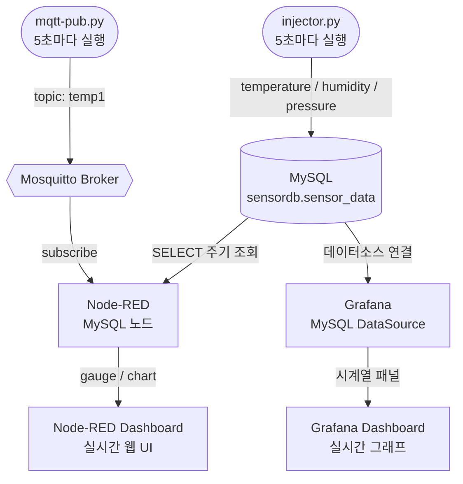
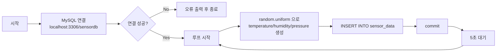
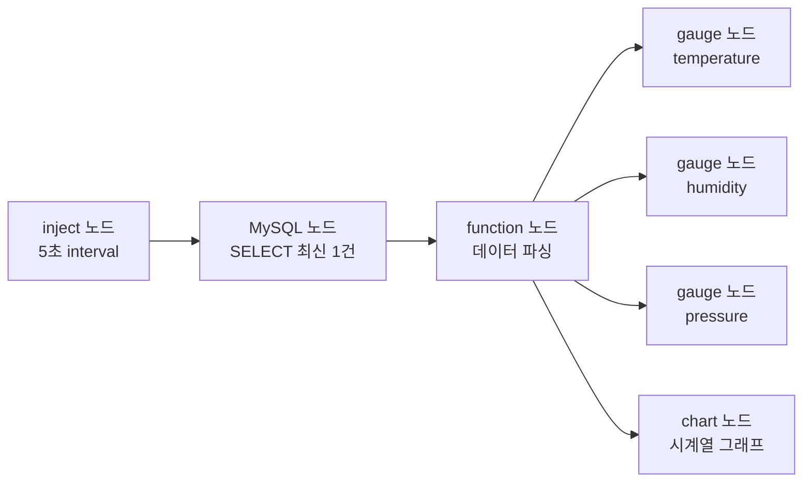
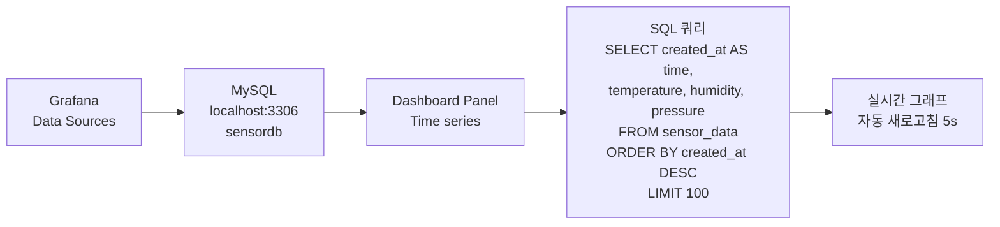
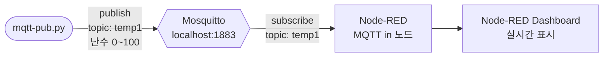
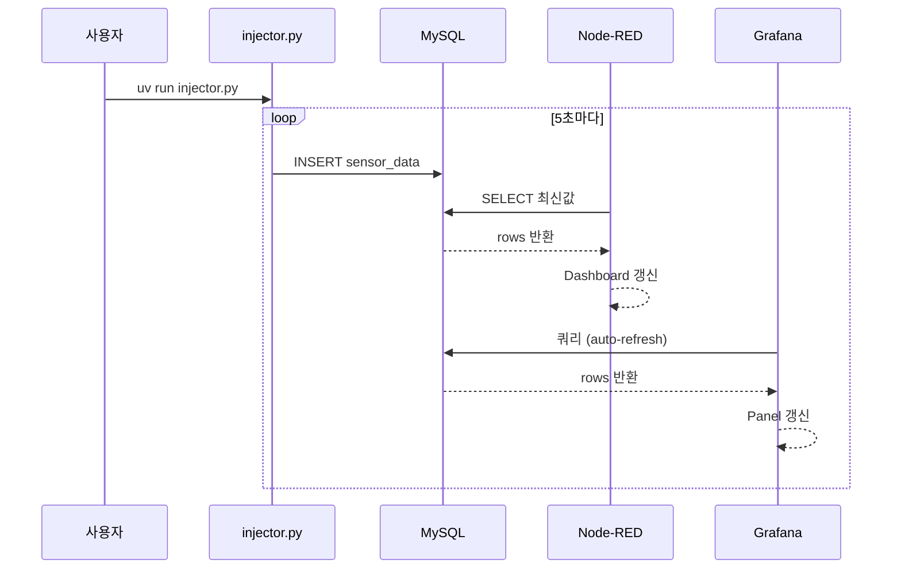

# Project: IoT Sensor Dashboard

랜덤 센서 데이터를 MySQL에 주입하고, Node-RED 및 Grafana 대시보드에서 실시간으로 모니터링하는 통합 IoT 실습 프로젝트입니다.

---

## 시스템 구성

| 컴포넌트 | 역할 |
|----------|------|
| **injector.py** | Python으로 랜덤 센서값(temperature, humidity, pressure) 생성 → MySQL INSERT |
| **MySQL (LAMP)** | 센서 데이터 영구 저장소 |
| **Node-RED** | MySQL에서 데이터를 읽어 웹 대시보드로 실시간 시각화 |
| **Grafana** | MySQL을 데이터소스로 연결, 시계열 그래프 실시간 모니터링 |
| **Mosquitto** | MQTT 브로커 — mqtt-pub.py에서 topic `temp1`으로 publish |

---

## 전체 동작 흐름



---

## 1. injector.py 동작 설명



---

## 2. Node-RED 플로우 설명



**Node-RED 주요 설정**
- MySQL 노드: `localhost`, `sensordb`, user/password 설정
- inject 노드: repeat interval = 5초
- 대시보드 접속: `http://localhost:1880/ui`

---

## 3. Grafana 대시보드 설명



**Grafana 주요 설정**
- Data Source: MySQL, Host=`localhost:3306`, Database=`sensordb`
- Panel Type: Time series
- Auto refresh: 5s
- 접속: `http://localhost:3000`

---

## 4. MQTT 흐름



---

## 5. 전체 실행 순서



---

## MySQL 초기 설정 SQL

```sql
CREATE DATABASE IF NOT EXISTS sensordb;
USE sensordb;
CREATE TABLE IF NOT EXISTS sensor_data (
    id          INT AUTO_INCREMENT PRIMARY KEY,
    temperature FLOAT,
    humidity    FLOAT,
    pressure    FLOAT,
    created_at  DATETIME DEFAULT CURRENT_TIMESTAMP
);
```
