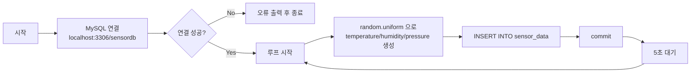
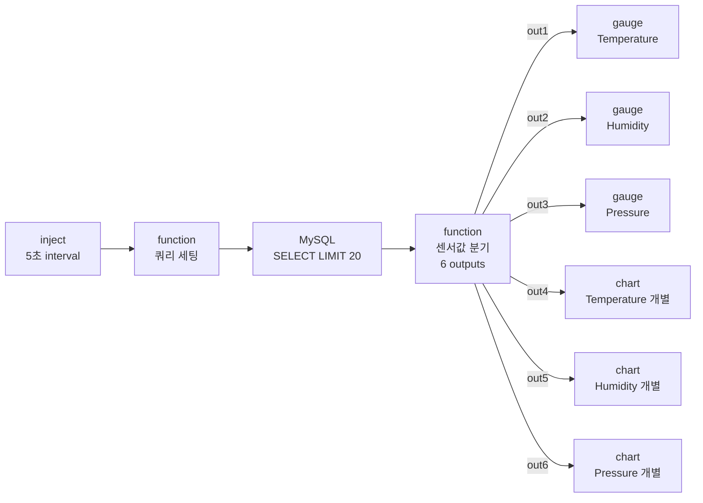
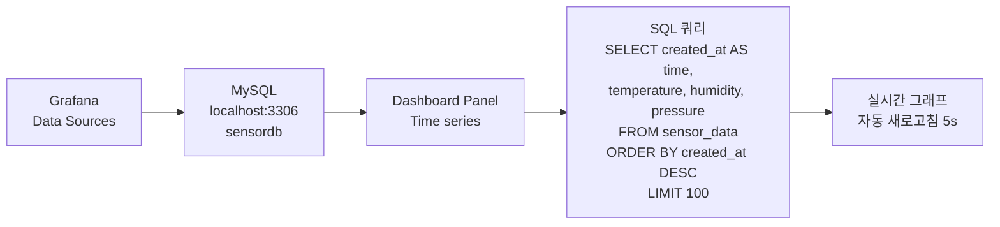
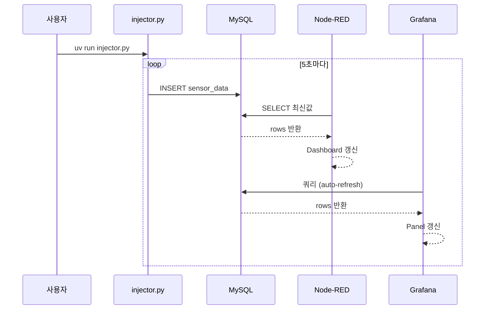

# Project: IoT Sensor Dashboard

랜덤 센서 데이터를 MySQL에 주입하고, Node-RED 및 Grafana 대시보드에서 실시간으로 모니터링하는 통합 IoT 실습 프로젝트입니다.

---

## 시스템 구성

| 컴포넌트 | 역할 |
|----------|------|
| **injector.py** | Python으로 랜덤 센서값(temperature, humidity, pressure) 생성 → MySQL INSERT |
| **MySQL (LAMP)** | 센서 데이터 영구 저장소 |
| **Node-RED** | MySQL에서 데이터를 읽어 웹 대시보드로 실시간 시각화 |
| **Grafana** | MySQL을 데이터소스로 연결, 시계열 그래프 실시간 모니터링 |
| **Mosquitto** | MQTT 브로커 — mqtt-pub.py에서 topic `temp1`으로 publish |

---

## 전체 동작 흐름


---

## 1. injector.py 동작 설명



---

## 2. Node-RED 플로우 설명



### 설치 필요 팔레트

Node-RED 메뉴 → **Manage palette** → Install 탭에서 설치:

```
node-red-dashboard
node-red-node-mysql
```

### Flow import 방법

1. Node-RED 우상단 메뉴 → **Import**
2. `nodered-flow.json` 파일 내용 붙여넣기 → **Import** 클릭
3. MySQL 노드 더블클릭 → Database 설정에서 user/password 입력 후 **Update**
4. **Deploy** 클릭

### 노드별 설정 상세

| 노드 | 설정값 |
|------|--------|
| inject | Repeat: interval / every **5** seconds |
| MySQL | Host: `127.0.0.1`, Port: `3306`, Database: `sensordb` |
| gauge × 3 | Min: `0`, Max: `100`, Tab: Sensor Monitor |
| ui_chart | Type: Line, Y-axis 0~100, Remove older: 1시간 |

### 대시보드 접속

```
http://localhost:1880/ui
```

---

## 3. Grafana 대시보드 설명



**Grafana 패널 쿼리 (각 패널 개별 적용)**

Temperature:
```sql
SELECT created_at AS time, temperature AS value
FROM sensor_data WHERE created_at >= NOW() - INTERVAL 1 HOUR
ORDER BY created_at ASC
```
Humidity:
```sql
SELECT created_at AS time, humidity AS value
FROM sensor_data WHERE created_at >= NOW() - INTERVAL 1 HOUR
ORDER BY created_at ASC
```
Pressure:
```sql
SELECT created_at AS time, pressure AS value
FROM sensor_data WHERE created_at >= NOW() - INTERVAL 1 HOUR
ORDER BY created_at ASC
```

**Grafana 주요 설정**
- Data Source: MySQL, Host=`localhost:3306`, Database=`sensordb`
- Panel Type: Time series (개별 3패널)
- Format: Time series
- Auto refresh: 5s
- 접속: `http://localhost:3000`
- 참고: `$__timeFilter` 대신 `NOW() - INTERVAL 1 HOUR` 사용 (KST 저장으로 인한 시간대 문제)

---

## 4. MQTT 흐름


---

## 5. 전체 실행 순서



---

## MySQL 초기 설정 SQL

```sql
CREATE DATABASE IF NOT EXISTS sensordb;
USE sensordb;
CREATE TABLE IF NOT EXISTS sensor_data (
    id          INT AUTO_INCREMENT PRIMARY KEY,
    temperature FLOAT,
    humidity    FLOAT,
    pressure    FLOAT,
    created_at  DATETIME DEFAULT CURRENT_TIMESTAMP
);
```
