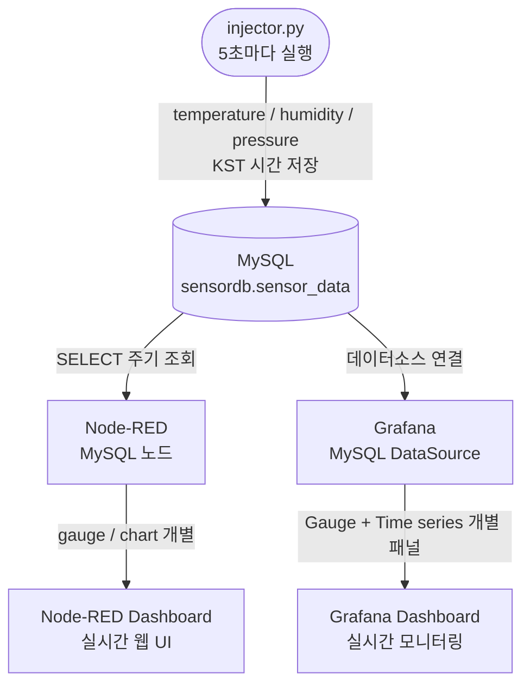
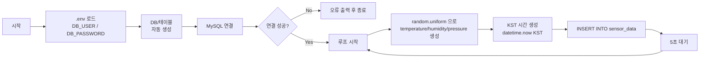
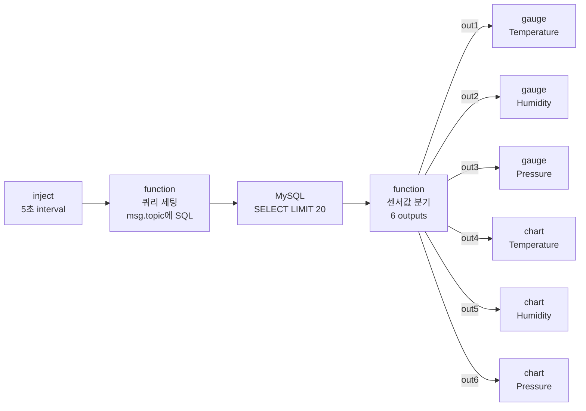
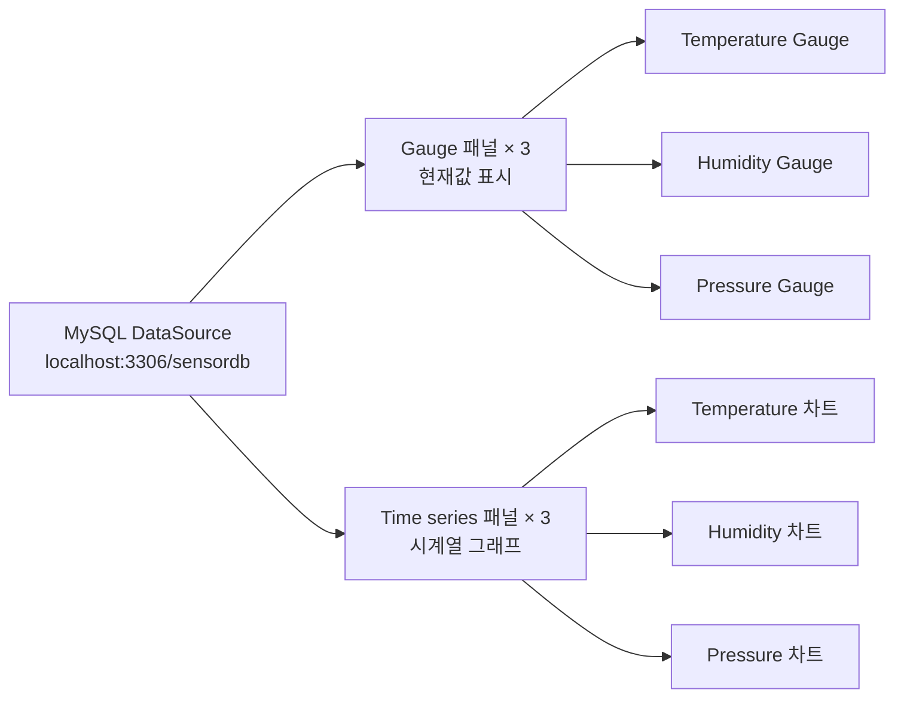
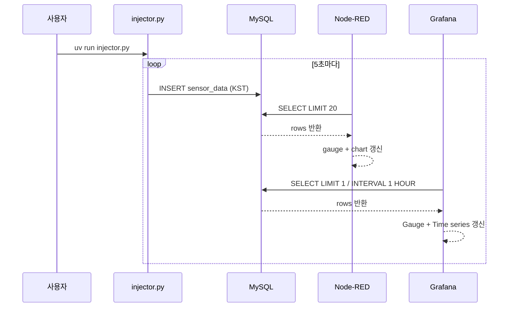

# Project: IoT Sensor Dashboard

랜덤 센서 데이터를 MySQL에 주입하고, Node-RED 및 Grafana 대시보드에서 실시간으로 모니터링하는 통합 IoT 실습 프로젝트입니다.

---

## 시스템 구성

| 컴포넌트 | 역할 |
|----------|------|
| **injector.py** | Python으로 랜덤 센서값(temperature, humidity, pressure) 생성 → MySQL INSERT |
| **MySQL (LAMP)** | 센서 데이터 영구 저장소 |
| **Node-RED** | MySQL에서 데이터를 읽어 웹 대시보드로 실시간 시각화 |
| **Grafana** | MySQL을 데이터소스로 연결, Gauge + 시계열 그래프 실시간 모니터링 |

---

## 전체 동작 흐름



---

## 1. injector.py 동작 설명

- DB 접속 정보는 `.env` 파일에서 로드 (python-dotenv)
- DB/테이블 없으면 자동 생성
- KST(UTC+9) 시간으로 저장



### 환경변수 설정 (.env)

```
DB_HOST=localhost
DB_PORT=3306
DB_USER=your_mysql_user
DB_PASSWORD=your_mysql_password
DB_NAME=sensordb
```

### 실행

```bash
uv run injector.py
```

---

## 2. Node-RED 플로우 설명



### 설치 팔레트

```
node-red-dashboard
node-red-node-mysql
```

### Flow import 방법

1. Node-RED 우상단 메뉴 → **Import**
2. `nodered-flow.json` 선택 → **Import**
3. MySQL 노드 더블클릭 → user/password 입력 → **Update**
4. **Deploy**

### 노드별 설정

| 노드 | 설정값 |
|------|--------|
| inject | Repeat: every **5** seconds |
| function(쿼리 세팅) | msg.topic = SQL 쿼리 |
| MySQL | Host: `127.0.0.1`, Port: `3306`, Database: `sensordb` |
| gauge × 3 | Min: `0`, Max: `100` |
| ui_chart × 3 | Type: Line, Y-axis 0~100, 개별 그룹 |

### 대시보드 접속

```
http://localhost:1880/ui
```

---

## 3. Grafana 대시보드 설명



### Gauge 패널 쿼리 (Format: Table)

```sql
-- Temperature
SELECT temperature AS value FROM sensor_data ORDER BY created_at DESC LIMIT 1

-- Humidity
SELECT humidity AS value FROM sensor_data ORDER BY created_at DESC LIMIT 1

-- Pressure
SELECT pressure AS value FROM sensor_data ORDER BY created_at DESC LIMIT 1
```

### Gauge 패널 설정

| 항목 | 값 |
|------|----|
| Visualization | Gauge |
| Format | **Table** |
| Calculation | Last * |
| Min | `0` |
| Max | `100` |
| Show threshold markers | ON |
| Thresholds | Base=초록 / 60=노랑 / 80=빨강 |

### Time series 패널 쿼리 (Format: Time series)

```sql
-- Temperature
SELECT created_at AS time, temperature AS value
FROM sensor_data WHERE created_at >= NOW() - INTERVAL 1 HOUR
ORDER BY created_at ASC

-- Humidity
SELECT created_at AS time, humidity AS value
FROM sensor_data WHERE created_at >= NOW() - INTERVAL 1 HOUR
ORDER BY created_at ASC

-- Pressure
SELECT created_at AS time, pressure AS value
FROM sensor_data WHERE created_at >= NOW() - INTERVAL 1 HOUR
ORDER BY created_at ASC
```

### Time series 패널 스타일

| 항목 | 값 |
|------|----|
| Fill opacity | `20` |
| Gradient mode | `Opacity` |
| Line width | `2` |

### 대시보드 레이아웃

```
┌────────────┬────────────┬────────────┐
│ Temperature│  Humidity  │  Pressure  │  ← Gauge (현재값 + 바)
│   Gauge    │   Gauge    │   Gauge    │
├────────────┴────────────┴────────────┤
│         Temperature 시계열            │
├─────────────────────────────────────┤
│          Humidity 시계열              │
├─────────────────────────────────────┤
│          Pressure 시계열              │
└─────────────────────────────────────┘
```

### 주요 설정

- Data Source: MySQL, Host=`localhost:3306`, Database=`sensordb`
- Timezone: `Asia/Seoul` (대시보드 Settings → General)
- Auto refresh: `5s`
- Kiosk 모드: 키보드 `k` 또는 URL에 `?kiosk` 추가
- 접속: `http://localhost:3000`
- 참고: `$__timeFilter` 대신 `NOW() - INTERVAL 1 HOUR` 사용 (KST 저장으로 인한 시간대 문제)

---

## 4. 전체 실행 순서


